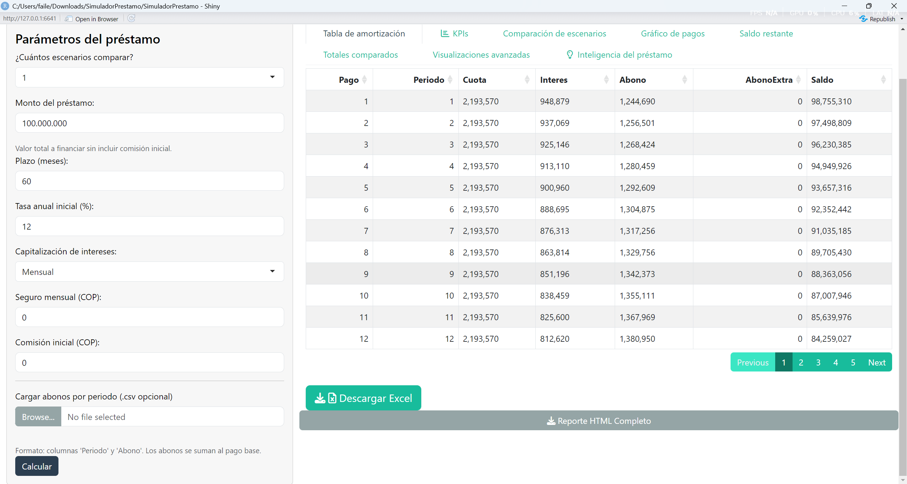
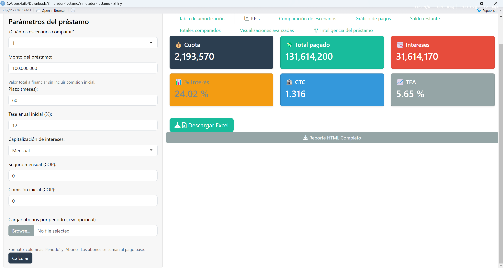
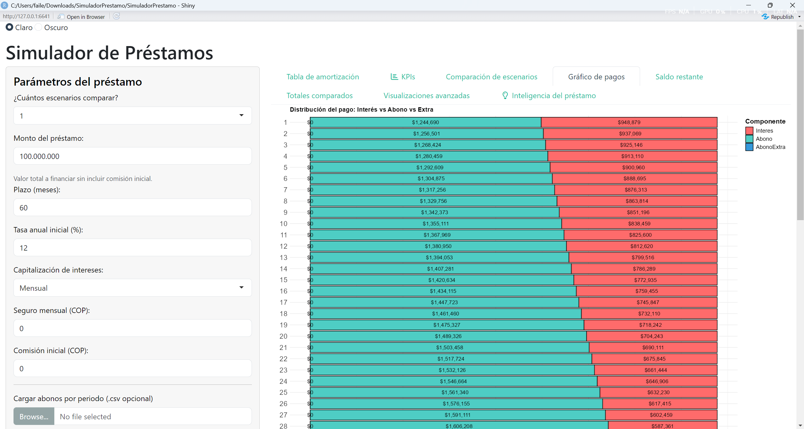
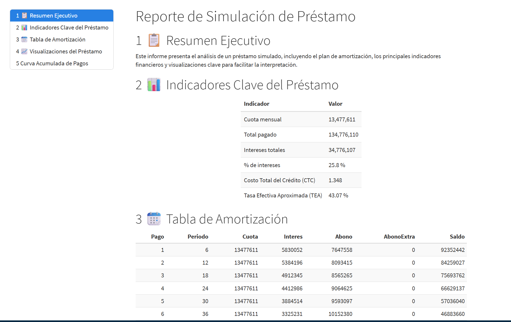

# 💼 Simulador de Préstamos Interactivo en R + Shiny

📈 **Simula, visualiza y analiza préstamos financieros con tasas fijas o variables, capitalización personalizada y generación de reportes profesionales.**  
Esta app te permite entender el impacto real de un préstamo antes de tomar decisiones financieras importantes. Diseñado para ser amigable, visual y práctico, con lógica realista e indicadores clave.

---

## 🧠 ¿Por qué usar este simulador?

Tomar un préstamo sin conocer todos los costos puede ser riesgoso.  
Este simulador te permite:

✅ Evaluar préstamos con distintos plazos, tasas, montos y condiciones  
✅ Comparar **dos escenarios financieros simultáneamente**  
✅ Observar la evolución del **saldo**, los **intereses pagados** y los **abonos a capital**  
✅ Detectar situaciones de riesgo con **alertas inteligentes**  
✅ Exportar resultados en **Excel** o **HTML** listos para presentar

---

## 🖼️ Capturas de pantalla

### Panel principal



Este es el corazón de la aplicación. Aquí puedes ingresar los datos del préstamo: monto, tasa, plazo y frecuencia de capitalización.
También puedes activar un segundo escenario para comparar condiciones. Todo está diseñado para ser claro y fácil de usar.

### 🎯 KPIs Visuales


Una vez calculado el préstamo, se muestran los indicadores clave: cuota mensual, total pagado, intereses, TEA y más.
Cada tarjeta usa colores e íconos para que puedas entender en segundos si el préstamo es conveniente o no.

### 📊 Gráfico de pagos detallado


Este gráfico muestra la evolución del pago por periodo, dividiendo la cuota en:

Interés (color rojo): lo que pagas por financiarte.

Abono a capital (color azul celeste): lo que reduce tu deuda.

Abono extra (color azul oscuro cuando aplica): pagos adicionales opcionales que aceleran el pago y reducen intereses.
Es muy útil para ver cómo evoluciona el pago a lo largo del tiempo, especialmente si hay amortización acelerada.

### 🧾 Visualizacion avanzada


Esta visualización muestra cómo se acumulan los pagos a lo largo del tiempo:

🔻 Intereses acumulados (línea roja): reflejan el costo financiero del préstamo en el tiempo.

🔸 Abonos acumulados a capital (línea verde): muestran cuánto has reducido la deuda total.

Es una herramienta poderosa para visualizar el ritmo del pago y entender en qué momento se superan los intereses o si los abonos están logrando reducir la deuda efectivamente.

**Una curva de abono que crece más rápido que la de interés es señal de un préstamo eficiente o de estrategias como abonos extra.**

### 🧾 Exportación de reporte HTML


¿Necesitas guardar o presentar los resultados? Con un clic puedes descargar un reporte en formato HTML.
Incluye la tabla de amortización, los KPIs y los gráficos principales, ya formateados y listos para compartir.


> Las visualizaciones se adaptan automáticamente a tu selección de periodo de capitalización: mensual, bimestral, trimestral o semestral.

---

## ⚙️ ¿Qué incluye esta app?

| Módulo                    | Descripción |
|---------------------------|-------------|
| 🧮 Cálculo financiero      | Basado en lógica realista de amortización francesa |
| 🔁 Capitalización editable | Personaliza cada cuánto se acumulan intereses |
| 📊 Visualizaciones        | Gráficos con `ggplot2`, escalas dinámicas y colores temáticos |
| 🧾 Exportación             | Reportes a Excel (`.xlsx`) y HTML (`.html`) con formato |
| 📁 Importación de tasas   | Soporte para archivos `.csv` con tasas variables o abonos |
| 🧠 Inteligencia financiera | Alertas automáticas sobre eficiencia del préstamo |

---

## 📂 Estructura del Proyecto

### 5. **📁 Estructura del repositorio**
```markdown
## 📁 Estructura del repositorio
SimuladorPrestamo/
├── app.R # Archivo principal que lanza la app
├── modules/
│ └── server_logic.R # Lógica del servidor
├── ui/
│ ├── ui_sidebar.R # Menú lateral
│ ├── ui_tabs.R # Pestañas principales
├── helpers/
│ ├── amortizacion.R # Funciones para cálculos financieros
│ ├── kpis.R # Cálculo de indicadores clave
├── reporte/
│ └── plantilla.Rmd # Plantilla para reporte HTML
├── www/
│ └── styles.css # Estilos personalizados
├── README.md

```

## 📤 Despliegue en línea

La app está disponible en:

👉 [https://izy7oi-juan0esteban-castilla0baquero.shinyapps.io/simuladorprestamo/](https://izy7oi-juan0esteban-castilla0baquero.shinyapps.io/simuladorprestamo/)

## 🛠️ ¿Qué se viene?

✨ Algunas ideas en desarrollo:

- Proyección de tasas por inflación
- Soporte para múltiples perfiles de usuario

---

## 🙋‍♂️ ¿Quién hizo esto?

**Juan Esteban Castilla Baquero**  
📧 jcastillab17@gmail.com  
🔗 [LinkedIn](https://www.linkedin.com/in/tu_usuario) | [GitHub](https://github.com/jcastillab)

---

## ⭐ ¿Te gustó el proyecto?

¡No olvides dejar una estrella ⭐ en el repositorio si te pareció útil o interesante!
